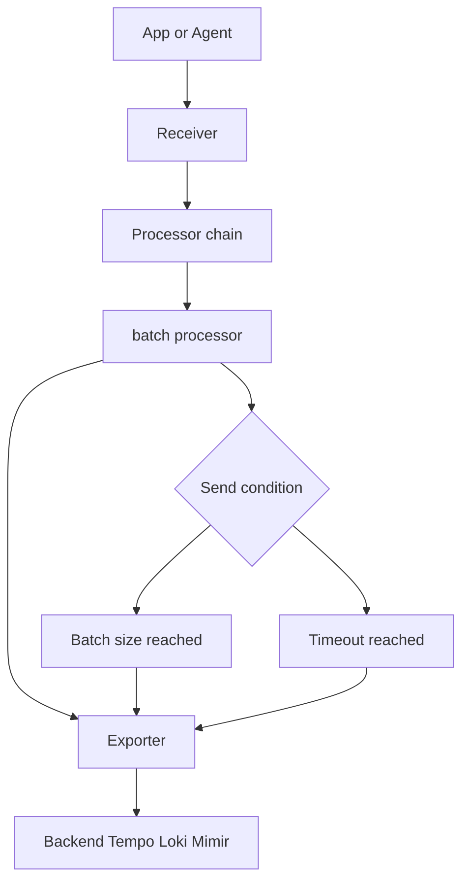

# OpenTelemetry 中 batch processor 的作用

OpenTelemetry Collector 里的 `batch processor`，通俗讲就是：

**把一条一条来的遥测数据，先攒一小批，再一起发给后端。**

这里的遥测数据包括：

- traces / spans
- metrics
- logs

它的作用很像快递打包：

> 不用每来一个包裹就派一次车，而是先攒一车货，再统一发出去。

---

## 为什么需要 batch processor？

### 1. 减少网络请求次数

如果没有 batch：

```text
span1 -> 发一次
span2 -> 发一次
span3 -> 发一次
span4 -> 发一次
```

有 batch 后：

```text
span1
span2
span3
span4
   ↓
攒成一批
   ↓
一次性发送
```

这样可以减少 Collector 到后端，比如 Tempo、Loki、Mimir、OTLP backend 的请求次数。

---

### 2. 提高吞吐量

后端通常更喜欢批量写入。

比如 Tempo / Loki / Mimir 这类后端，批量写入比一条一条写入效率更高。

```text
应用/Agent
   ↓
OTel Collector
   ↓
batch processor
   ↓
exporter
   ↓
Tempo / Loki / Mimir
```

---

### 3. 降低 exporter 压力

如果没有 batch，exporter 可能要非常频繁地发送请求。

有 batch 后，exporter 处理的是一批一批的数据：

```text
receiver -> processor -> exporter
              |
              +-- batch processor
```

这能让 exporter 更稳定，不容易因为请求过多而抖动。

---

### 4. 改善后端写入性能

很多后端写入时都有固定开销，比如：

- 建立请求
- 序列化数据
- 认证鉴权
- 压缩
- 网络传输
- 后端解析

如果一条一条写，这些成本会被重复很多次。

batch 可以把这些成本摊薄。

---

## 一个简单例子

假设你的 Collector 每秒收到 1000 个 span。

不用 batch：

```text
每秒可能发出 1000 次小请求
```

使用 batch：

```text
每秒可能只发出 10 次大请求
```

整体效果是：

```text
请求少了
吞吐高了
CPU/网络开销低了
后端更稳定了
```

---

## 常见配置示例

```yaml
processors:
  batch:
    timeout: 5s
    send_batch_size: 8192
    send_batch_max_size: 10000
```

含义大概是：

```yaml
processors:
  batch:
    timeout: 5s                # 最多等 5 秒，时间到了就发
    send_batch_size: 8192      # 攒到 8192 条左右就发
    send_batch_max_size: 10000 # 单次最多发送 10000 条
```

---

## 它什么时候会发送数据？

batch processor 一般有两个触发条件：

### 条件一：数量够了

```text
攒够 send_batch_size
马上发送
```

### 条件二：时间到了

```text
即使数量没攒够
只要 timeout 到了
也会发送
```

也就是说：

```text
数量够了就发
数量不够但等太久了也发
```

---

## 在 pipeline 里的位置

一般 batch processor 放在 processor 链的后面，靠近 exporter。

例如：

```yaml
service:
  pipelines:
    traces:
      receivers: [otlp]
      processors: [memory_limiter, k8sattributes, resource, batch]
      exporters: [otlp/tempo]

    logs:
      receivers: [otlp]
      processors: [memory_limiter, k8sattributes, resource, batch]
      exporters: [otlphttp/loki]

    metrics:
      receivers: [otlp]
      processors: [memory_limiter, k8sattributes, resource, batch]
      exporters: [prometheusremotewrite]
```

通常推荐顺序是：

```text
memory_limiter -> attributes/resource/k8sattributes -> batch -> exporter
```

原因是：

- `memory_limiter` 要尽早保护 Collector
- `k8sattributes/resource/attributes` 先把数据补充完整
- `batch` 最后把处理好的数据统一打包发送

---

## Mermaid 流程图



---

## 需要注意什么？

### 1. batch 不是缓存系统

它只是短时间攒一批数据，不是长期存储。

Collector 挂了，batch 里还没发出去的数据可能会丢。

如果你需要更强的可靠性，要考虑：

```text
sending_queue
persistent queue
Kafka
```

---

### 2. batch 可能带来一点点延迟

因为它会等数据攒够或者等 timeout 到。

比如：

```yaml
timeout: 5s
```

意味着低流量场景下，数据可能最多晚几秒发送。

如果你希望更实时，可以降低 timeout：

```yaml
timeout: 1s
```

---

### 3. batch 太大可能增加内存压力

比如：

```yaml
send_batch_size: 50000
```

这可能让 Collector 内存压力变大。

一般不要盲目调太大。

---

## 一个实用推荐配置

对于大多数 Collector，可以先用类似配置：

```yaml
processors:
  memory_limiter:
    check_interval: 1s
    limit_mib: 1024
    spike_limit_mib: 256

  batch:
    timeout: 1s
    send_batch_size: 8192
    send_batch_max_size: 10000
```

pipeline：

```yaml
service:
  pipelines:
    traces:
      receivers: [otlp]
      processors: [memory_limiter, k8sattributes, resource, batch]
      exporters: [otlp/tempo]

    logs:
      receivers: [otlp]
      processors: [memory_limiter, k8sattributes, resource, batch]
      exporters: [otlphttp/loki]

    metrics:
      receivers: [otlp]
      processors: [memory_limiter, batch]
      exporters: [prometheusremotewrite]
```

---

## 一句话总结

**batch processor 的作用就是：把零散的 telemetry 数据合并成批量请求再发送，从而减少请求次数、提升吞吐、降低 exporter 和后端压力；代价是可能增加一点点延迟和内存占用。**
